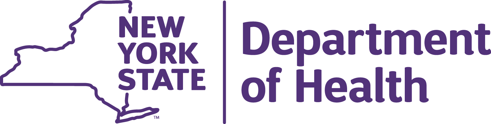
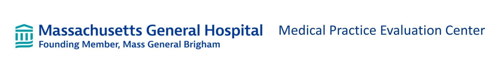

# Professional Experience 

## Program Research Specialist II/Data Analyst, July 2022-July 2024
Office of Science, New York State Department of Health 

-   Analyzed millions of childhood immunization records using SAS, SQL, and R in support of state polio response and measles preparedness

-   Designed data strategy and training for program for community health workers to encourage uptake of childhood immunizations

-   Produced ad-hoc data reports and literature reviews on emerging health topics shared with Health Commissioner

-   Developed models of poliovirus and measles transmission to estimate outbreak size and potential using R and Excel, in collaboration with CDC

-   Coordinated website strategy and advised on design of public dashboards, coordinating among 15 internal teams and 57 local health departments

-   Developed and analyzed surveys of New Yorkers attitudes toward seasonal vaccines using SAS and presented findings to internal stakeholders which resulted in journal publication

## Project Coordinator, August 2021-July 2022
Medical Practice Evaluation Center, Massachusetts General Hospital

-   Led simulation modeling study of impact of COVID-19 on HIV care for youth with HIV resulting in first-author publication 

-   Conducted additional modeling studies of life expectancy and optimal testing regimens for youth with HIV in the US and South Africa

-   Executed data cleaning and analysis of COVID-19 contact tracing data for thousands of students from Massachusetts public schools using R

-   Presented results at internal meetings and conferences, using engaging and insightful visualizations

#### Research Assistant, August 2020-July 2021

-   Performed agent-based simulation modeling analyses to answer health policy questions related to youth with HIV

-   Developed a new webtool using R Shiny and python to forecast global antiretroviral drug needs for children with HIV for the WHO

-   Analyzed data from cohort studies, clinical trials, and observational databases to inform model inputs

## Undergraduate Researcher, January 2019 – July 2020
Fang-Yen Lab, University of Pennsylvania Bioengineering

-   Conducted independent research into the biomechanics of C. Elegans pharyngeal pumping

-   Planned and carried out various assays and experiments to understand worm feeding behavior

-   Collected high speed footage of the microscopic worms using DIC microscopy

-   Analyzed video data and synthesized results into clear graphs and figures

-   Presented results of research and contributed to writing of published journal article

## Unit Head, June 2015 – August 2019
Camp Yavneh, Northwood, NH					        

-   Managed a staff of 11 counselors, including providing performance feedback and mediating disputes

-   Organized and planned leadership, educational, and recreational activities for 60 adolescent campers

-   Coordinated day-to-day logistics, planned daily programs and events, and led field trips out of camp

-   Corresponded with senior camp staff to address camper and counselor issues

# Education
## Columbia Mailman School of Public Health, New York, NY

Expected graduation: May, 2026

Masters of Science in Biostatistics

Concentration: Public Health Data Science

## University of Pennsylvania, Philadelphia, PA, May 2020

Bachelor of Arts | Magna Cum Laude | Benjamin Franklin Scholar (80/2,500 students)

Major: Biological Physics (with Distinction) | Minor: Religious Studies

# Publications
-   **Brenner IR**, Flanagan CF, Penazzato M, Webb KA, Horsfall SB, Hyle EP, Abrams E, Bacha J, Neilan AM, Collins IJ, Desmonde S, Crichton S, Davies MA, Freedberg KA, Ciaranello AL. Cost-effectiveness of viral load testing for transitioning antiretroviral therapy-experienced children to dolutegravir in South Africa: a modelling analysis. The Lancet Global Health. 2024;12(12):e2068-e2079. doi:10.1016/S2214-109X(24)00381-4

-   Kalkowska DA, Badizadegan K, Routh JA, Burns CC, Rosenberg ES, **Brenner IR**, Zucker JR, Langdon-Embry M, Thompson KM. Modeling undetected poliovirus circulation following the 2022 outbreak in the United States. Expert Review of Vaccines. 2024;23(1):186-195. doi:10.1080/14760584.2023.2299401.

-   Neilan AM, Ufio OL, **Brenner IR**, Flanagan CF, Shebl FM, Hyle EP, Freedberg KA, Ciaranello AL, Patel K. Projected Life Expectancy for Adolescents With HIV in the US. JAMA Health Forum. 2024;5(5):e240816. doi:10.1001/jamahealthforum.2024.0816.

-   Mitchell EC, Nguyen T, Boulais M, **Brenner IR**, Dorabawila V, Hoen R, Li Y, Cavazos M, Levine B, Anderson BJ, Battles H, Brissette I, Backenson B, Lutterloh E, Bauer UE, Rosenberg ES. Home testing for SARS-CoV-2 and impact on surveillance in New York State. Annals of Epidemiology. Published online November 22, 2023. doi:10.1016/j.annepidem.2023.11.009.

-   **Brenner IR**, Simpson KN, Flanagan CF, Dark T, Dooley M, Agwu AL, Koay WLA, Freedberg KA, Ciaranello AL, Neilan AM. Projecting the clinical and economic impacts of changes to HIV care among adolescents and young adults in the US: lessons from the COVID-19 pandemic. J Pediatric Infect Dis Soc. Published online November 14, 2023:piad102. doi:10.1093/jpids/piad102.

-   Thompson KM, Kalkowska DA, Routh JA, **Brenner IR**, Rosenberg ES, Zucker JR, Langdon-Embry M, Sugerman DE, Burns CC, Badizadegan K. Modeling poliovirus transmission and responses in New York State. J Infect Dis. 2023 Aug 19:jiad355. doi: 10.1093/infdis/jiad355. Epub ahead of print. PMID: 37596838.

-   Nelson SB, Dugdale CM, **Brenner IR**, Crawford A, Bilinski A, Cosar D, Pollock NR, Ciaranello A. Prevalence and Risk Factors for School-Associated Transmission of SARS-CoV-2. JAMA Health Forum. 2023 Aug 4;4(8):e232310. doi: 10.1001/jamahealthforum.2023.2310. PMID: 37540523; PMCID: PMC10403780.

-   Nelson SB, **Brenner IR**, Homan E, Lee SB, Bongiorno C, Pollock NR, Ciaranello A. Evaluation of "Test to Return" after COVID-19 Diagnosis in a Massachusetts Public School District. J Sch Health. 2023 Jun 4. doi: 10.1111/josh.13357. Epub ahead of print. PMID: 37272202.

-   **Brenner IR**, Raizen DM, Fang-Yen C. Pharyngeal timing and particle transport defects in Caenorhabditis elegans feeding mutants. J Neurophysiol. 2022 Aug 1;128(2):302-309. doi: 10.1152/jn.00444.2021. Epub 2022 Jun 22. PMID: 35730757.

# Skills and interests

Technical skills: R/Rstudio, Python, SQL, SAS, MATLAB, Excel, Git/Github, Linear Algebra, Ordinary and Partial Differential Equations

Language: Fluent in Hebrew

Interests: Rock climbing, Guitar, Cooking, Running, Cycling
