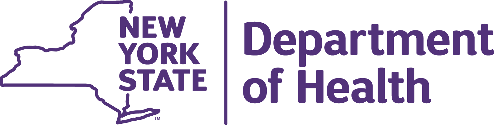
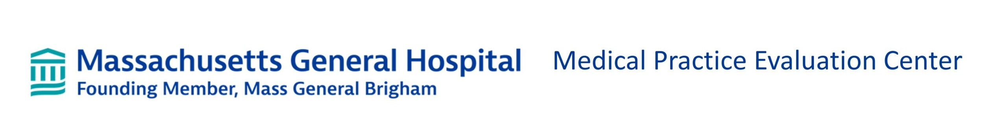

 
 

# Professional Experience 

### Data Analyst/Biostatistician

#### Meyers Lab, Aaron Diamond AIDS Research Center, Columbia University, May 2025-Present

-	Lead data management and analysis for a multi-site study, using R and reproducible workflows to monitor real-world implementation of long-acting injectable HIV treatment to thousands of patients
-   Develop and deploy interactive R Shiny dashboards on AWS to disseminate outcomes to 8 participating clinics, supporting data-driven decision-making 
-   Use machine learning to predict missed care opportunities, monitor for health equity, and ensure optimal outcomes across all patients
-   Create reusable data processing and visualization tools with thorough documentation to support cross-functional teams and non-technical stakeholders
-   Consult on study designs, statistical analysis plans, and power analyses for new studies
-   Implement AI-assisted workflows to accelerate dashboard and tool development from weeks to hours

### Program Research Specialist II/Data Analyst

#### Office of Science, New York State Department of Health, July 2022-July 2024

-   Analyzed millions of childhood immunization records using SAS, SQL, and R in support of state polio response and measles preparedness

-   Designed data strategy and training for program for community health workers to encourage uptake of childhood immunizations

-   Produced ad-hoc data reports and literature reviews on emerging health topics shared with Health Commissioner

-   Developed models of poliovirus and measles transmission to estimate outbreak size and potential using R and Excel, in collaboration with CDC

-   Coordinated website strategy and advised on design of public dashboards, coordinating among 15 internal teams and 57 local health departments

-   Developed and analyzed surveys of New Yorkers attitudes toward seasonal vaccines using SAS and presented findings to internal stakeholders which resulted in journal publication

### Project Coordinator

#### Medical Practice Evaluation Center, Massachusetts General Hospital, August 2021-July 2022

-   Led simulation modeling study of impact of COVID-19 on HIV care for youth with HIV resulting in first-author publication 

-   Conducted additional modeling studies of life expectancy and optimal testing regimens for youth with HIV in the US and South Africa

-   Executed data cleaning and analysis of COVID-19 contact tracing data for thousands of students from Massachusetts public schools using R

-   Presented results at internal meetings and conferences, using engaging and insightful visualizations

#### Research Assistant, August 2020-July 2021

-   Performed agent-based simulation modeling analyses to answer health policy questions related to youth with HIV

-   Developed a new webtool using R Shiny and python to forecast global antiretroviral drug needs for children with HIV for the WHO

-   Analyzed data from cohort studies, clinical trials, and observational databases to inform model inputs

### Undergraduate Researcher
#### Fang-Yen Lab, University of Pennsylvania Bioengineering, , January 2019 – July 2020

-   Conducted independent research into the biomechanics of C. Elegans pharyngeal pumping

-   Planned and carried out various assays and experiments to understand worm feeding behavior

-   Collected high speed footage of the microscopic worms using DIC microscopy

-   Analyzed video data and synthesized results into clear graphs and figures

-   Presented results of research and contributed to writing of published journal article

### Unit Head

#### Camp Yavneh, Northwood, NH, , June 2015 – August 2019					        

-   Managed a staff of 11 counselors, including providing performance feedback and mediating disputes

-   Organized and planned leadership, educational, and recreational activities for 60 adolescent campers

-   Coordinated day-to-day logistics, planned daily programs and events, and led field trips out of camp

-   Corresponded with senior camp staff to address camper and counselor issues

# Education
### Columbia Mailman School of Public Health, New York, NY, May 2026

Masters of Science in Biostatistics

Concentration: Public Health Data Science

### University of Pennsylvania, Philadelphia, PA, May 2020

Bachelor of Arts | Magna Cum Laude | Benjamin Franklin Scholar (80/2,500 students)

Major: Biological Physics (with Distinction) | Minor: Religious Studies

# Skills and interests

Software and programming: R, Python, SQL, SAS, MATLAB, Excel, Git/Github, QGIS

Statistical modeling and machine learning: LMs/GLMs, mixed-effects models, survival analysis, simulation modeling, network science, GIS analysis, supervised/unsupervised learning, deep learning/neural networks

Interests: Rock climbing, Guitar, Cooking, Running, Cycling

